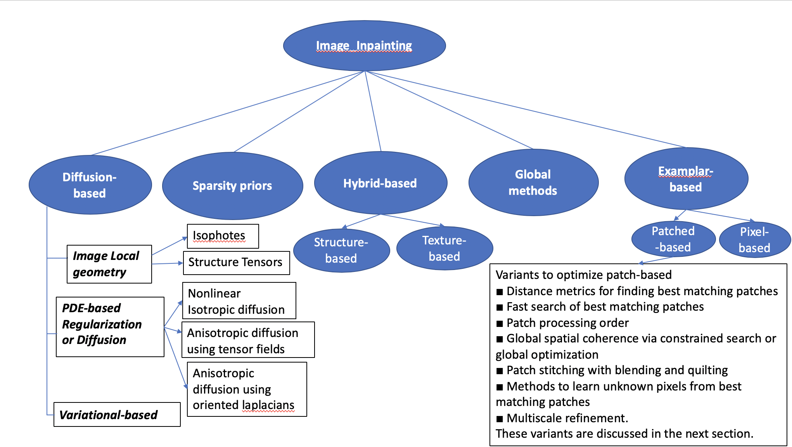
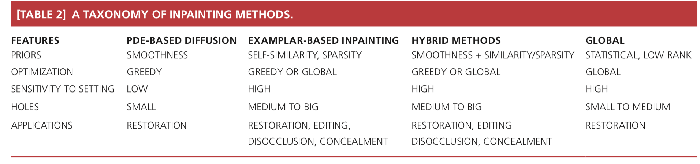

# Papers-on-Image-Inpainting

Image inpainting is the process of reconstructing missing parts of an image so that observers are unable to tell that these regions have undergone restoration. This technique is often used to remove unwanted objects from an image or to restore damaged portions of old photos. The figures below show example image-inpainting results.

-------------------------------------
# Surveys

[1] Christine Guillemot, Olivier Le Meur . Image Inpainting : Overview and Recent Advances [pdf](https://ieeexplore.ieee.org/stamp/stamp.jsp?arnumber=6678248)

-------------------------------------
# Automatic Inpainting Methods

[1] Deep Image Prior ([Ulyanov, Vedaldi, and Lempitsky, 2017](https://arxiv.org/abs/1711.10925))

[2] Globally and Locally Consistent Image Completion ([Iizuka, Simo-Serra, and Ishikawa, 2017](http://hi.cs.waseda.ac.jp/~iizuka/projects/completion/en/))

[3] High-Resolution Image Inpainting ([Yang et al., 2017](https://arxiv.org/abs/1611.09969))

[4] Shift-Net ([Yan et al., 2018](https://arxiv.org/abs/1801.09392))

[5] Generative Image Inpainting With Contextual Attention ([Yu et al., 2018](https://arxiv.org/abs/1801.07892))

[6] Image Inpainting for Irregular Holes Using Partial Convolutions ([Liu et al., 2018](https://arxiv.org/abs/1804.07723))

-------------------------------------
# Traditional Image In-Painting Methods Taxonomy

-------------------------------------
# Table of Image In-Painting Taxonomy

-------------------------------------
# Image Inpainting papers and codes that can be tried out

# Deep Learning Methods

 * Convolution Based
   
 Year|Proceeding|Title|dataset|code
  --|:--:|:--:|:--:|--
  2014|NIPS 2014|[Deep Convolutional Neural Network for Image Deconvolution](http://papers.nips.cc/paper/5485-deep-convolutional-neural-network-for-image-deconvolution.pdf)|||
  2015|NIPS|[Shepard Convolutional Neural Networks](https://papers.nips.cc/paper/5774-shepard-convolutional-neural-networks.pdf)||[code](https://github.com/jimmy-ren/vcnn_double-bladed/tree/master/applications/Shepard_CNN)|
   2016|CVPR 2016|[**Context Encoders: Feature Learning by Inpainting**](https://arxiv.org/abs/1604.07379)||[code](https://github.com/pathak22/context-encoder)|
  2018|ECCV|[Image inpainting for irregular holes using partial convolutions](https://arxiv.org/abs/1804.07723)||[code](https://github.com/Jasonnor/PConv-Keras-Food)|
  2018|Arxiv|[Free-Form Image Inpainting with Gated Convolution](https://arxiv.org/abs/1806.03589)|Places2 [Zhou et al. 2017] and CelebA-HQ faces [Karras et al. 2017]| [code](http://jiahuiyu.com/deepfill2/)|
   2018| |[Deep_image_prior](https://arxiv.org/abs/1711.10925)|ImageNet ISLVRC|[code](https://github.com/DmitryUlyanov/deep-image-prior)|         
 2018 | |[Generative_inpainting_release](https://arxiv.org/abs/1801.07892)|Faces (CelebA, CelebA-HQ), textures (DTD) and natural images (ImageNet, Places2)|[code](https://github.com/JiahuiYu/generative_inpainting)|   
 2018||[Deep laplacian pyramid networks for fast and accurate superresolution](https://arxiv.org/abs/1704.03915)|bench_mark datasets|[code](https://github.com/phoenix104104/LapSRN)|
 2018|ECCV 2018|[Image Inpainting for Irregular Holes Using Partial Convolutions](https://arxiv.org/pdf/1804.07723.pdf)||[code](https://github.com/NVIDIA/partialconv)|
2018|NIPS 2018|[Image Inpainting via Generative Multi-column Convolutional Neural Networks](https://arxiv.org/pdf/1810.08771.pdf)|| [code](https://github.com/shepnerd/inpainting_gmcnn)|
2018|AISTATS 2019|[Probabilistic Semantic Inpainting with Pixel Constrained CNNs](https://arxiv.org/pdf/1810.03728.pdf)|||
2018|TOG 2018|[Faceshop: Deep sketch-based face image editing](https://arxiv.org/pdf/1804.08972.pdf)|||
 
 
*  Generative Adversarial Networks
 
 Year|Proceeding|Title|dataset|code
--|:--:|:--:|:--:|--
 2017|SIGGRAPH 2017 |[Globally and Locally Consistent Image Completion](http://hi.cs.waseda.ac.jp/~iizuka/projects/completion/data/completion_sig2017.pdf)||[code](https://github.com/satoshiiizuka/siggraph2017_inpainting)|
 2018|CVPR|[Eye In-Painting With Exemplar Generative Adversarial Networks](http://openaccess.thecvf.com/content_cvpr_2018/papers/Dolhansky_Eye_In-Painting_With_CVPR_2018_paper.pdf)||[code](https://github.com/bdol/exemplar_gans)|
2018|CVPR|[UV-GAN: Adversarial Facial UV Map Completion for Pose-invariant Face Recognition](http://openaccess.thecvf.com/content_cvpr_2018/papers/Deng_UV-GAN_Adversarial_Facial_CVPR_2018_paper.pdf)||
2018|arXiv:1808.04432|[X-GANs: Image Reconstruction Made Easy for Extreme Cases](https://arxiv.org/pdf/1808.04432.pdf)|||
2018|arXiv:1801.07632|[High Resolution Face Completion with Multiple Controllable Attributes via Fully End-to-End Progressive Generative Adversarial Networks](https://arxiv.org/pdf/1801.07632.pdf)|||
2019|arXiv:1902.06838|[SC-FEGAN: Face Editing Generative Adversarial Network with User's Sketch and Color](https://arxiv.org/pdf/1902.06838.pdf)||[code](https://github.com/JoYoungjoo/SC-FEGAN)  |
2019|arXiv:1902.09225|[Harmonizing Maximum Likelihood with GANs for Multimodal Conditional Generation](https://arxiv.org/pdf/1902.09225.pdf)|||
2019||[Photo-realistic single image super-resolution using a generative adversarial network](https://arxiv.org/abs/1609.04802)|benchmark datasets Set5, Set14, and BSD100, the testing set of BSD300|[code](https://github.com/tensorlayer/srgan)|
2019|CVPR 2019|[Pluralistic Image Completion](https://arxiv.org/abs/1903.04227)| buildings (Paris), faces (CelebA-HQ), and natural images (ImageNet)|[code](https://github.com/lyndonzheng/Pluralistic-Inpainting)|

* Denoising auto-encoder

   Year|Proceeding|Title|dataset|code
   --|:--:|:--:|:--|--
   2012|NIPS 2012| [Image denoising and inpainting with deep neural networks](http://papers.nips.cc/paper/4686-image-denoising-and-inpainting-with-deep-neural-networks.pdf)|||

* Mask-specific

  Year|Proceeding|Title|dataset|code
   --|:--:|:--:|:--|--
   2014|GCPR 2014| [Mask-specific inpainting with deep neural networks](https://link.springer.com/chapter/10.1007/978-3-319-11752-2_43)|||
   
* Contextual-based

   Year|Proceeding|Title|dataset|code
   --|:--:|:--:|:--|--
   2017|CVPR 2017|[**Semantic image inpainting with deep generative models**](http://openaccess.thecvf.com/content_cvpr_2017/papers/Yeh_Semantic_Image_Inpainting_CVPR_2017_paper.pdf)|||
   2018|CVPR 2018|[**Generative Image Inpainting with Contextual Attention**](https://arxiv.org/abs/1801.07892)||[code](https://github.com/JiahuiYu/generative_inpainting)|
   2018|ECCV 2018| [Contextual-based Image Inpainting: Infer, Match, and Translate](https://arxiv.org/pdf/1711.08590.pdf)|||
   2018|MM 2018|[Semantic Image Inpainting with Progressive Generative Networks](https://dl.acm.org/citation.cfm?id=3240625)||[code](https://github.com/crashmoon/Progressive-Generative-Networks)|

* Point Cloud 

  Year|Proceeding|Title|dataset|code
   --|:--:|:--:|:--|--
   2019|arXiv:1904.10795 |[Graph-based Inpainting for 3D Dynamic Point Clouds](https://arxiv.org/pdf/1904.10795.pdf)|||

 
# Traditional Methods

## A. Diffusion-based

     
 Year|Proceeding|Title|dataset|code
 --|:--:|:--:|:--:|--
2000|SIGGRAPH 2000|[**Image Inpainting**](https://dl.acm.org/citation.cfm?id=344972)  ||
2001|TIP 2001|[Filling-in by joint interpolation of vector fields and gray levels](https://conservancy.umn.edu/bitstream/handle/11299/3462/1/1706.pdf)||
2002|EJAM 2002|[Digital inpainting based on the mumford–shah–euler image model](https://www.cambridge.org/core/services/aop-cambridge-core/content/view/26ACC4694C7F064B6F40D55C09ACA9A1/S0956792502004904a.pdf/digital_inpainting_based_on_the_mumfordshaheuler_image_model.pdf)  |||
2003|TIP 2003|[Simultaneous structure and texture image inpainting](https://ieeexplore.ieee.org/stamp/stamp.jsp?tp=&arnumber=1217265)|| 
2003|ICCV 2003|[Learning How to Inpaint from Global Image Statistics](https://ieeexplore.ieee.org/stamp/stamp.jsp?tp=&arnumber=1238360)| |
2007|CSVT 2007|[Image Compression With Edge-Based Inpainting](https://www.microsoft.com/en-us/research/wp-content/uploads/2016/12/inpainting_csvt_07.pdf)||

## B. Hybrid-based
   ### * B.1 Texture Synthesis
   
  Year|Proceeding|Title|dataset|code
--|:--:|:--:|:--:|--
   2016|SIGGRAPH 2016|[High-resolution multi-scale neural texture synthesis](https://wxs.ca/research/multiscale-neural-synthesis/Snelgrove-multiscale-texture-synthesis.pdf)|||
## C. Examplar-based
   ### * C.1 Patch-based
  Year|Proceeding|Title|dataset|code
--|:--:|:--:|:--:|--
   2003|TOG 2003|[Fragment-based image completion](http://delivery.acm.org/10.1145/890000/882267/p303-drori.pdf?ip=222.195.92.10&id=882267&acc=ACTIVE%20SERVICE&key=BF85BBA5741FDC6E%2EA4F9C023AC60E700%2E4D4702B0C3E38B35%2E4D4702B0C3E38B35&__acm__=1553430113_8d3cc7f5adde2fb3894043de791d9150) | |
2004|TIP 2004|[**Region Filling and Object Removal by Exemplar-Based Image Inpainting**](https://www.microsoft.com/en-us/research/wp-content/uploads/2016/02/criminisi_tip2004.pdf)||
2005|SIGGRAPH 2005|[Image Completion with Structure Propagation](http://jiansun.org/papers/ImageCompletion_SIGGRAPH05.pdf)|| 
2009|SIGGRAPH 2009|[**PatchMatch: a randomized correspondence algorithm for structural image editing**](http://www.faculty.idc.ac.il/arik/seminar2009/papers/patchMatch.pdf)  ||
2010| TIP 2010|[Image inpainting by patch propagation using patch sparsity](https://ieeexplore.ieee.org/stamp/stamp.jsp?tp=&arnumber=5404308) ||
2011|ICIP 2011|[Examplar-based inpainting based on local geometry](https://ieeexplore.ieee.org/stamp/stamp.jsp?tp=&arnumber=6116441)||
2012|TOG 2012|[Combining inconsistent images using patch-based synthesis](http://citeseerx.ist.psu.edu/viewdoc/download?doi=10.1.1.364.5147&rep=rep1&type=pdf)||
2014|TOG 2014|[**Image completion using Planar structure guidance**](https://www.microsoft.com/en-us/research/wp-content/uploads/2017/01/structure_completion_small.pdf)||
2017|CVPR|[**High-resolution image inpainting using multi-scale neural patch synthesis**](http://openaccess.thecvf.com/content_cvpr_2017/papers/Yang_High-Resolution_Image_Inpainting_CVPR_2017_paper.pdf)||[code](https://github.com/leehomyc/Faster-High-Res-Neural-Inpainting)|
2018|arXiv:1803.07422|[Patch-Based Image Inpainting with Generative Adversarial Networks](https://arxiv.org/pdf/1803.07422.pdf)| |[code](https://github.com/nashory/pggan-pytorch)|
2019|arXiv:1903.10885 |[Learning Quadrangulated Patches For 3D Shape Processing](https://arxiv.org/pdf/1903.10885.pdf)|||

# Reference:

[1] Image Inpainting: Humans vs. AI [Survey blog](https://github.com/1900zyh/Awesome-Image-Inpainting)

[2] Awesome-Image-Inpainting [GitHub topics](https://towardsdatascience.com/image-inpainting-humans-vs-ai-48fc4bca7ecc)

[3] [Image Inapinting](https://github.com/geekyutao/Image-Inpainting)

[4] [Google Scholar](https://scholar.google.com/scholar?q=Inpainting+/+Image+completion+surveys&hl=en&as_sdt=0,1&as_vis=1).

[5] [image-inpainting](https://paperswithcode.com/task/image-inpainting)

[6] Christine Guillemot, Olivier Le Meur . Image Inpainting : Overview and Recent Advances [pdf](https://ieeexplore.ieee.org/stamp/stamp.jsp?arnumber=6678248)

